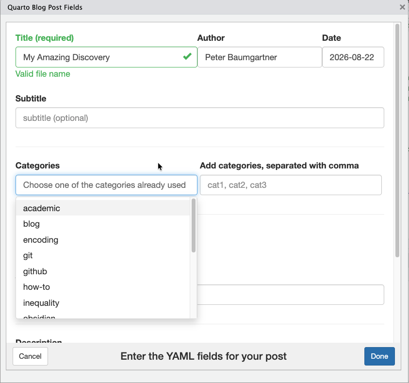

```{r, include = FALSE}
knitr::opts_chunk$set(
  collapse = TRUE,
  comment = "#>"
)
```

The **qpost** package provides two functions for maintaining a Quarto blog:

- `qpost()` — an interactive dialog that scaffolds a new blog post directory, `index.qmd` file, and correctly formatted YAML front matter
- `add_coins()` — appends [COinS](https://en.wikipedia.org/wiki/COinS) metadata to a finished post so reference managers like Zotero can automatically import it

`qpost()` opens an interactive dialog and **requires a pane-capable IDE (RStudio or Positron)**; it will stop with an error if run from a plain R console, `Rscript`, or a non-interactive script. `add_coins()` also auto-detects the active file in RStudio/Positron, but can be used from any R session by passing `file_path` explicitly.

## Installation

```r
install.packages("qpost")
```

## Creating a post with `qpost()`

```r
library(qpost)
qpost()
```

This opens an interactive dialog (in the Viewer pane or a separate window) where you fill in the post's title, author, date, and optional fields like subtitle, categories, and a featured image. On submit, `qpost()` creates the post directory and `index.qmd`, then opens the file for editing.

```{r dialog-screenshot, fig.align='center', out.width='75%', echo=FALSE, fig.cap='The qpost() dialog window', fig.alt='Dialog window showing input fields for title, author, date and subtitle'}

```

`qpost()` is also available as an RStudio Addin under **Addins > Create Quarto Post**, so you can bind it to a keyboard shortcut.

For the full list of dialog fields, `.Rprofile` configuration options, generated output structure, and troubleshooting, see [Creating Quarto Blog Posts with qpost](quarto-blog-posts.html).

## Adding COinS metadata with `add_coins()`

With COinS, you provide metadata from your blog posts to software tools like bibliography managers, enabling automatic retrieval and making it easier to cite your articles correctly.

Once a post is written, run:

```r
add_coins()
```

on the currently open post to append a hidden COinS `<span>` at the end of the post. Zotero and similar tools detect this span and automatically fill in the title, author, date, and other citation details when saving your post to a library.

For an explanation of what COinS is, why it matters, and how to configure auto-resolution of metadata fields, see [Adding COinS Metadata for Zotero](add-coins.html).

## Next Steps

- [Creating Quarto Blog Posts with qpost](quarto-blog-posts.html) — full `qpost()` reference
- [Adding COinS Metadata for Zotero](add-coins.html) — full `add_coins()` reference
- [Quarto Blog Documentation](https://quarto.org/docs/websites/website-blog.html)
</content>
